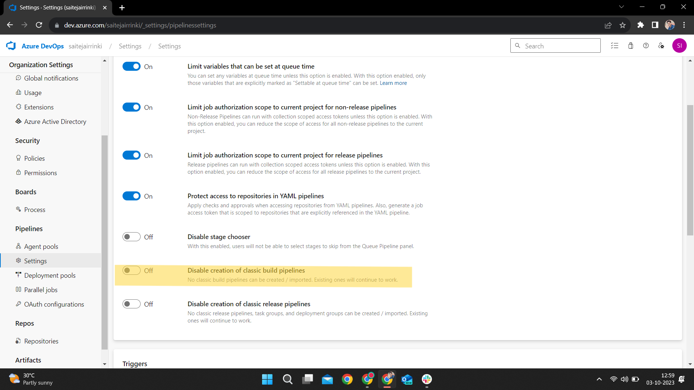

# Enabling Classic Pipelines in Azure DevOps: A Step-by-Step Guide 🚀

If you've been struggling to find the option to create a classic pipeline in Azure DevOps, don't worry; we've got you covered! The absence of this option likely means that classic pipeline creation has been disabled in your organization or project settings. Fear not, as we will guide you through the process of enabling this feature step by step, ensuring you can harness its power for your development needs. 🔧

## Prerequisites 📋

Before diving into the steps, please ensure that you have the following prerequisites:

- **Azure DevOps Account**: You should have an Azure DevOps account with the necessary permissions to adjust settings within your organization and projects.

Now, let's get started on enabling classic pipelines in both your organization and project settings.

**For Organization Settings:**

1. **Sign In**: Begin by logging in to your Azure DevOps account with your credentials. 💼

2. **Select Organization**: Click on your organization's name, located at the top right corner of the Azure DevOps portal. This will grant you access to organization-level settings. 🏢

3. **Organization Settings**: In the dropdown menu, select "Organization settings." This is where you'll manage settings at the organization level. ⚙️

4. **Pipelines Settings**: Within the left-hand sidebar, navigate to the "Pipelines" section, and click on "Settings." 🛠️

5. **Enable Classic Pipelines**: Inside the "Settings" page, keep an eye out for an option related to classic pipelines, and ensure it is enabled. The specific wording and location may vary based on your Azure DevOps version and updates. 🔄

6. **Save Changes**: Don't forget to save your changes after enabling classic pipelines. Your settings will be applied. 💾

**For Project Settings:**

1. **Sign In**: Start by logging in to your Azure DevOps account using your credentials. 💼

2. **Select Project**: Choose the specific project for which you want to enable classic pipelines. This step allows you to adjust settings at the project level. 📂

3. **Project Settings**: In the left-hand sidebar, click on "Project settings." ⚙️

4. **Pipelines Settings**: Navigate to the "Pipelines" section under project settings and click on "Settings." 🛠️

5. **Enable Classic Pipelines**: Similar to the organization settings, seek out an option related to classic pipelines within the project settings, and ensure it's enabled. 🔄

6. **Save Changes**: Once you've enabled classic pipelines at the project level, don't forget to save your changes to apply them. 💾

By following these precise steps for both organization and project settings, you will successfully enable the creation of classic pipelines in Azure DevOps. Remember that the specific wording and location of the settings may vary based on your Azure DevOps version, so keep an eye out for similar terms related to classic pipelines. With classic pipelines enabled, you'll be well on your way to optimizing your development workflow. Good luck with your projects! 🌟
